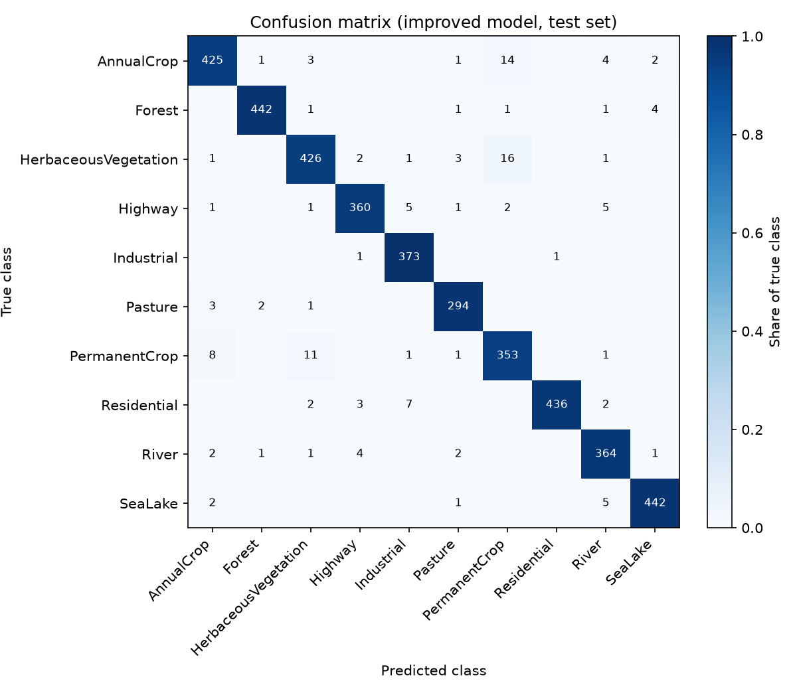
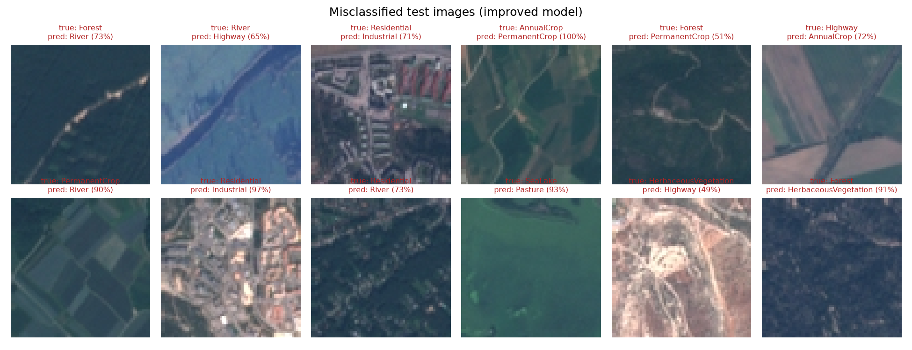
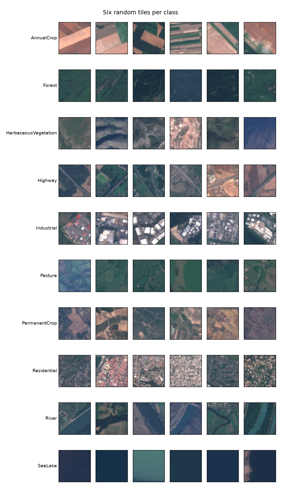

# Land-Use Classification of Satellite Images with CNNs


Convolutional neural networks (TensorFlow/Keras) that classify **Sentinel-2 satellite images** into **10 land-use classes**, such as forest, river, residential or highway, using the public **EuroSAT** dataset.

The project goes end to end: data exploration, a baseline CNN, an improved CNN with domain-specific data augmentation, a held-out test evaluation, error analysis, unit tests, CI and an auto-generated presentation.

## Results

All scores are measured once on a held-out test set of 4,050 images that was never used for training or model selection.

<!-- RESULTS:START -->
| Model | Parameters | Epochs | Training time | Test accuracy | Macro F1 |
|---|---:|---:|---:|---:|---:|
| Baseline CNN | 1,143,242 | 15 | 16.3 min (CPU) | **88.22%** | 0.878 |
| Improved CNN | 577,514 | 30 | 162.1 min (CPU) | **96.67%** | 0.966 |

Most frequent confusions (improved model):

- HerbaceousVegetation predicted as PermanentCrop: 16 images
- AnnualCrop predicted as PermanentCrop: 14 images
- PermanentCrop predicted as HerbaceousVegetation: 11 images
<!-- RESULTS:END -->

| Confusion matrix (improved model) | Misclassified test images |
|---|---|
|  |  |

## Dataset

**EuroSAT RGB** (Helber et al., 2019): 27,000 labelled 64 × 64 px tiles from the European Sentinel-2 satellite, 10 m per pixel, 10 classes with 2,000–3,000 images each.

| | |
|---|---|
| Download | Zenodo, record 7711810 (`EuroSAT_RGB.zip`, about 90 MB), or `python -m eurosat_cnn.download` |
| Original repository | https://github.com/phelber/EuroSAT |
| Paper | Helber, Bischke, Dengel, Borth, *EuroSAT: A Novel Dataset and Deep Learning Benchmark for Land Use and Land Cover Classification*, IEEE JSTARS, 2019 |

Why this dataset was chosen: see [`docs/DATASET.md`](docs/DATASET.md).



## Approach

| | Baseline CNN | Improved CNN |
|---|---|---|
| Convolution layers | 3 (32-64-128) | 7 (32, 2×64, 2×128, 256) |
| Classifier head | Flatten → Dense(128) → Dropout 0.3 | Global average pooling → Dropout 0.4 |
| Regularisation | Dropout | Batch normalisation, dropout, augmentation |
| Data augmentation | none | random flips, random 90° rotations, contrast ±10 % |
| Parameters | 1.14 M | 0.58 M |

Key design decisions:

- **Rotation and flip augmentation.** Satellite images have no canonical orientation, so a rotated field is still a field. A custom `RandomRot90` layer applies an independent 0/90/180/270° rotation to every image. This needs no interpolation and adds no padding artefacts.
- **Global average pooling** instead of a large dense layer halves the parameter count and reduces memorisation.
- **Fair evaluation.** A stratified, seeded 70/15/15 split. The validation set drives checkpointing, early stopping and learning-rate reduction; the test set is used once.

## Project structure

```
├── src/eurosat_cnn/         # installable package
│   ├── config.py            # paths, classes, split fractions, seed
│   ├── data.py              # file listing, stratified split, tf.data pipeline
│   ├── models.py            # baseline + improved CNN, RandomRot90 layer
│   ├── train.py             # CLI: training with checkpoints and early stopping
│   ├── evaluate.py          # CLI: test metrics, confusion matrix, error analysis
│   ├── eda.py               # CLI: exploratory figures
│   └── download.py          # CLI: dataset download
├── notebooks/               # step-by-step walkthrough (01 → 04)
├── tests/                   # pytest unit tests (data split, models, custom layer)
├── reports/                 # metrics (JSON), results table, figures
├── presentation/            # template + script that builds the slide deck from results
├── docs/                    # dataset notes and step-by-step guide
└── .github/workflows/       # CI: runs the tests on every push
```

## Quick start

```bash
git clone https://github.com/MSEldeeb/eurosat-cnn-classifier.git
cd eurosat-cnn-classifier
python -m venv .venv && source .venv/bin/activate      # Windows: .venv\Scripts\activate
pip install -e ".[dev,notebooks,presentation]"

python -m eurosat_cnn.download                          # ~90 MB into data/raw/EuroSAT_RGB
python -m eurosat_cnn.eda                               # figures in reports/figures
python -m eurosat_cnn.train --model baseline --epochs 15
python -m eurosat_cnn.train --model improved --epochs 30
python -m eurosat_cnn.evaluate                          # test metrics + README results table
python presentation/make_presentation.py                # slide deck from your results
pytest -q
```

Quick smoke test (a few minutes on a CPU): `python -m eurosat_cnn.train --model improved --epochs 1 --fraction 0.05`.

The notebooks in `notebooks/` walk through the same steps interactively with explanations and plots. The full guide is in [`docs/STEP_BY_STEP.md`](docs/STEP_BY_STEP.md).

## Possible next steps

- Transfer learning from an ImageNet-pretrained network (e.g. EfficientNet), which reaches about 98–99 % on EuroSAT in the literature
- Use all 13 Sentinel-2 spectral bands (`EuroSAT_MS`) instead of RGB only
- Saliency maps / Grad-CAM to explain individual predictions
- Serve the model as a small web demo

## Acknowledgements

Dataset: P. Helber, B. Bischke, A. Dengel, D. Borth. EuroSAT: A Novel Dataset and Deep Learning Benchmark for Land Use and Land Cover Classification. *IEEE Journal of Selected Topics in Applied Earth Observations and Remote Sensing*, 2019. Contains modified Copernicus Sentinel data.

## Author

**Mohamed Sabry Eldeeb, PhD**: physicist and software developer. [LinkedIn](https://www.linkedin.com/in/mohamed-eldeeb-1893b883/) · [Google Scholar](http://scholar.google.com/citations?hl=en&user=fkp4xfEAAAAJ)
